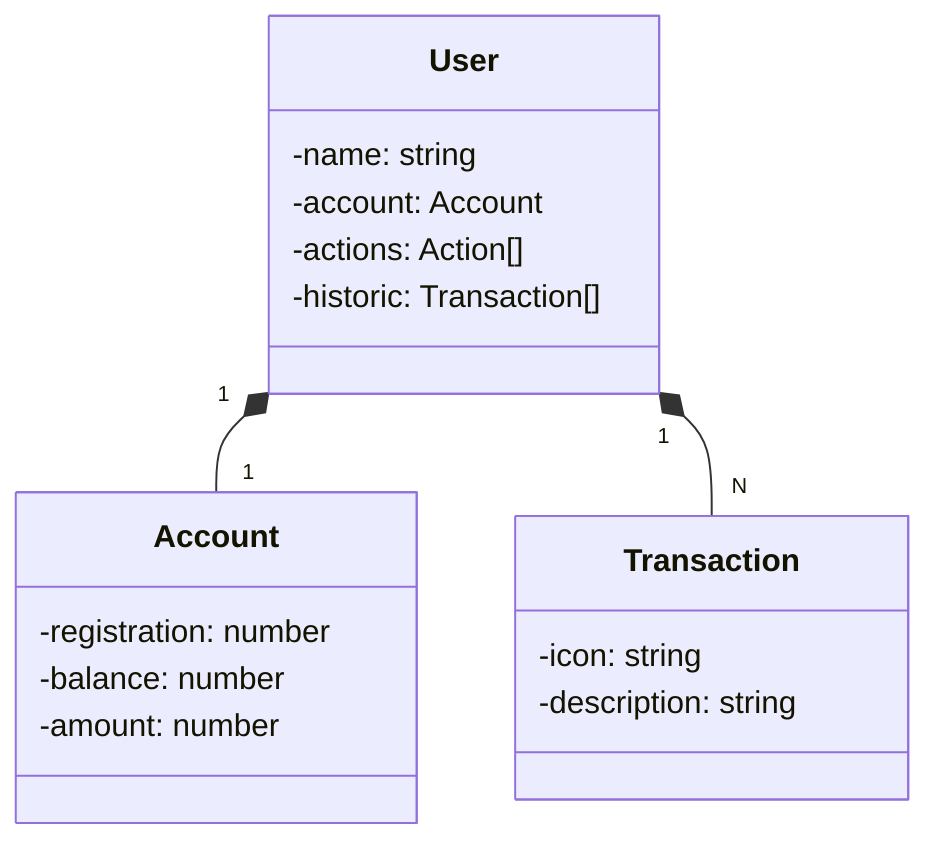

# Projeto API

Repositório para o projeto "Publicando Sua API REST na Nuvem Usando Spring Boot 3, Java 17 e Railway" com a digital Innovation One e Venilton Falvo Jr. Contribui com a minha versão de API para acompanhamento de pagamento de variável de uma empresa.

## Principais Tecnologias
- Java 17
- Spring Boot 3
- Spring Data JPA
- OpenAPI (Swagger)
- Railway
- ChatGPT

## Diagrama de classes

## Documentação da API

